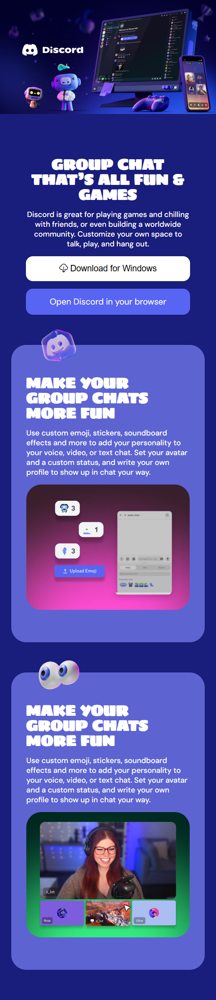

# HTML / CSS DISCORD EXERCISE

This project is the third exercise in the context of a Web Development Master Course. It is focused on HTML and CSS, including CSS Flexbox, and a more advanced focused on object positioning.

## TASK

The task is re-creating a web-page, provided by the teacher, by using HTML and CSS. This webpage is Discord landing page. 
The objective is to obtain a finalized page with responsive layout focused on structural CSS and clean HTML architecture:
* Focus: Flexbox/Grid and semantic HTML. The approach used is <b>Mobile-First<b>.
* Bonus tasks:  
1. changing card images with videos that automatically start and loop  
2. icons at the top but in the <b>center<b>
3. add a gradient in the cards background instead of one colour.

## PROJECT STRUCTURE

Htmlcss-discord-mobile/  
├── .gitignore  
├── index.html  
├── README.md  
├── screenshot.png  
├── bonus.png  
└── css/  
&nbsp;&nbsp;&nbsp;&nbsp;├── style.css  
└── img/  
&nbsp;&nbsp;&nbsp;&nbsp;├── background.png  
&nbsp;&nbsp;&nbsp;&nbsp;├── banner.png  
&nbsp;&nbsp;&nbsp;&nbsp;├── cloud-download.svg  
&nbsp;&nbsp;&nbsp;&nbsp;├── discord_cube.png  
&nbsp;&nbsp;&nbsp;&nbsp;├── discord_demo.png  
&nbsp;&nbsp;&nbsp;&nbsp;├── eyes.png  
&nbsp;&nbsp;&nbsp;&nbsp;├── icon.png  
&nbsp;&nbsp;&nbsp;&nbsp;├── logo.png  
&nbsp;&nbsp;&nbsp;&nbsp;├── mascotte.png  
&nbsp;&nbsp;&nbsp;&nbsp;├── megaphone.png  
&nbsp;&nbsp;&nbsp;&nbsp;├── streamer_demo.png  
└── video/  
&nbsp;&nbsp;&nbsp;&nbsp;├── streamer.mp4  
&nbsp;&nbsp;&nbsp;&nbsp;├── video_demo.mp4  

## REFERENCE WEBPAGE

## TECH STACK

* HTML5: semantic elements
* CSS3: custom properties / variables
* VSCode: development environment

## FEATURES

* Header with banner image
* First "card" with download and open button
* Other two cards, including icon, title, paragraph, and image/video (see above in "Task" for details)

